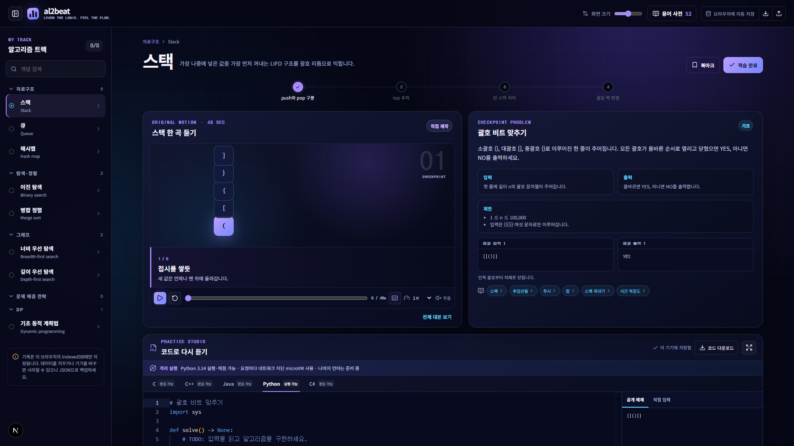
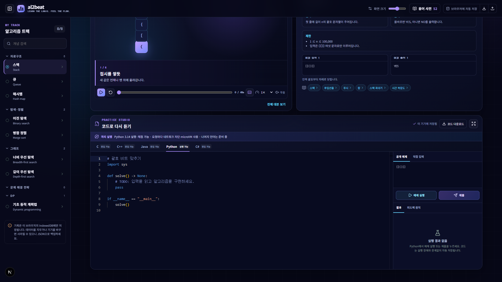
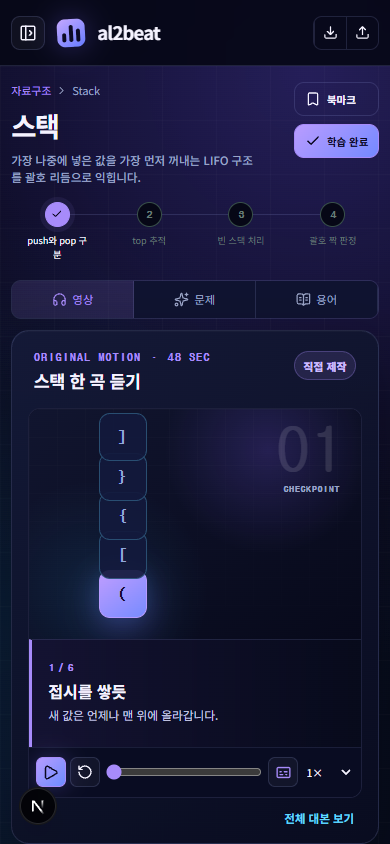

# al2beat

> **Learn the logic. Feel the flow.**<br>
> 알고리즘을 속도 경쟁이 아니라, 개념의 상태 변화를 보고 직접 반복하며 익히는 개인 학습 스튜디오입니다.

`al2beat`는 **algorithm to beat**와 **algorithm + beat**를 함께 담은 이름입니다. 여기서 beat는 순위를 가르는 속도가 아니라, 자료구조가 변하고 탐색이 진행되는 한 단계의 박자입니다. 학습자는 선수 개념부터 영상, 문제, 코드, 복습까지 이어지는 하나의 트랙을 자기 속도로 완주합니다.



## 왜 만들었나요?

알고리즘 학습은 종종 제한 시간, 정답률, 순위 중심으로 흘러갑니다. al2beat는 그 전에 필요한 일을 다룹니다.

- 자료구조의 상태가 왜 바뀌는지 눈으로 확인합니다.
- 짧은 설명을 여러 번 재생하고 대본으로 다시 읽습니다.
- 문제의 입출력과 제한을 이해한 뒤 직접 코드를 작성합니다.
- 틀렸을 때 확인된 사실과 점검할 가능성을 구분합니다.
- 회원가입 없이 시작하고, 학습 기록은 브라우저 안에 보관합니다.

점멸 효과, 강제 카운트다운, 자동 효과음, 경쟁 순위는 사용하지 않습니다. 빠르게 푸는 것보다 개념을 설명할 수 있을 때까지 반복하는 것이 목표입니다.

## 한 화면에서 이어지는 학습 흐름

```text
선수 개념 → 48초 모션 설명 → 체크포인트 문제 → 코드 연습 → 결과 확인 → 복습
```

1. **알고리즘 트랙**에서 분류와 학습 상태를 보고 다음 개념을 고릅니다.
2. **모션 설명**에서 상태 변화를 장면별로 확인합니다.
3. **체크포인트 문제**에서 입출력, 제한, 공개 예제, 관련 용어를 함께 읽습니다.
4. **Practice Studio**에서 언어별 코드를 작성하고 예제를 실행하거나 제출합니다.
5. 코드와 진도는 자동 저장되며 JSON으로 백업하고 다른 브라우저에서 복구할 수 있습니다.

## 주요 화면

### 알고리즘 트랙

왼쪽 탐색 영역은 자료구조, 탐색·정렬, 그래프, 문제 해결 전략, DP의 계층을 보여줍니다. 한글·영문 개념 검색, 북마크, 학습 중·복습·완료 상태를 지원합니다. 상단 체크포인트는 현재 개념에서 무엇을 확인하고 있는지 알려 줍니다.

### 직접 제작한 모션 설명

각 개념에는 외부 영상이나 자막을 가져오지 않고 직접 만든 48초 인터랙티브 모션이 연결되어 있습니다.

- 6개 장면을 순서대로 재생
- 자막 켜기·끄기와 전체 대본
- 0.75×, 1×, 1.25×, 1.5× 재생 속도
- 진행 위치 직접 이동과 처음부터 재생
- 의도적인 무음 설계와 `prefers-reduced-motion` 대응
- 화면을 가리지 않도록 시각화와 설명 영역을 분리한 레이아웃

스토리보드 원본은 [`content/storyboards/README.md`](content/storyboards/README.md)에 남아 있습니다.

### 체크포인트 문제

문제, 입출력 형식, 제한, 공개 예제를 한 카드에서 읽을 수 있습니다. 문제 안의 용어 칩을 누르면 사전 상세 설명이 열립니다. 문제·테스트·해설은 다른 코딩 사이트에서 수집하지 않고 이 프로젝트를 위해 직접 작성했습니다.

### Monaco 기반 Practice Studio



- C, C++, Java, Python, C# 문법 강조와 언어별 시작 템플릿
- 문제별·언어별 코드와 사용자 입력 자동 저장
- 공개 예제와 직접 입력 분리
- 예제 실행과 서버 전용 테스트 제출을 별도 동작으로 구분
- 코드 파일 다운로드와 IDE 집중 모드
- 정답, 오답, 구문 오류, 런타임 오류, 시간 초과, 출력 초과, 시스템 장애 구분
- 공개 테스트에서는 입력·기대 출력·실제 출력 비교
- 비공개 테스트에서는 입력과 기대 출력을 숨기고 작성자가 정한 실패 범주만 안내

현재 실제 실행·채점 경로는 **Python 3.14**부터 연결되어 있습니다. 나머지 네 언어는 편집과 자동 저장을 지원하지만, 격리 런타임 실측이 끝날 때까지 실행 가능으로 표시하지 않습니다.

| 언어 | 편집 | 예제 실행 | 제출 채점 | 현재 표시 |
|---|:---:|:---:|:---:|---|
| Python | ✅ | ✅ | ✅ | Vercel Sandbox 연결 시 실행 가능 |
| C | ✅ | — | — | 편집 가능 |
| C++ | ✅ | — | — | 편집 가능 |
| Java | ✅ | — | — | 편집 가능 |
| C# | ✅ | — | — | 편집 가능 |

> 로컬에서 Python 실행을 사용하려면 Vercel 프로젝트 연결과 유효한 OIDC 자격 증명이 필요합니다. 자격 증명이 없거나 무료 한도가 소진되면 `시스템 장애`로 표시하며, 편집 중인 코드는 잃지 않습니다. Monaco의 문법 강조만으로 실행 가능하다고 표시하지 않습니다.

### 모바일 학습

<p align="center">
  
</p>

작은 화면에서는 영상·문제·용어를 탭으로 전환합니다. 트랙 탐색은 접을 수 있고, 모션의 핵심 조작과 IDE 입력·결과 확인을 터치 화면에서도 사용할 수 있습니다.

## 현재 콘텐츠

모든 초기 콘텐츠는 `ready` 상태이며, 각 항목에 6장면 모션·대본·문제·공개 예제·관련 용어가 연결되어 있습니다.

| 분류 | 개념 | 체크포인트 문제 | 핵심 학습 |
|---|---|---|---|
| 자료구조 | 스택 | 괄호 비트 맞추기 | LIFO, push/pop, 빈 스택 |
| 자료구조 | 큐 | 연습실 버퍼 | FIFO, 앞/뒤 포인터, 용량 제한 |
| 자료구조 | 해시맵 | 오늘의 최다 비트 | 키·값, 빈도표, 동률 처리 |
| 탐색·정렬 | 이진 탐색 | 첫 임계 비트 | 정렬 조건, lower bound, 경계 |
| 탐색·정렬 | 병합 정렬 | 입장 순서를 지키는 믹스 | 분할·병합, 안정 정렬 |
| 그래프 | BFS | 최소 박자로 출구까지 | 큐, 거리, 방문 처리 |
| 그래프 | DFS | 분리된 리듬 섬 | 재귀/스택, 연결 요소 |
| DP | 기초 동적 계획법 | 최소 에너지 트랙 | 상태 정의, 점화식, 초기값 |

현재 수량은 다음과 같습니다.

- 개념 8개
- 직접 제작 모션 8개, 장면 48개
- 직접 작성 문제 8개
- 자체 작성 용어 52개

## 개발자 용어 사전

52개 항목을 한글, 영문, 약어, 동의어로 검색할 수 있습니다. 각 항목에는 다음 정보가 포함됩니다.

- 쉬운 정의
- 짧은 예시
- 언제 사용하는지
- 흔한 실수
- 관련 문제

원본 데이터는 [`content/glossary.json`](content/glossary.json)에 있습니다.

## 데이터 보존과 백업

첫 공개 버전은 회원가입과 서버 DB를 요구하지 않습니다.

- 코드: 문제별·언어별 IndexedDB 저장
- 학습 상태: 진행도, 북마크, 체크포인트 저장
- 입력: 문제별 사용자 입력 저장
- 백업: 상단 버튼으로 JSON 내보내기·가져오기
- 장애 대응: 실행 서비스가 멈춰도 코드 편집, 자동 저장, 파일 다운로드 유지

브라우저 사이트 데이터를 삭제하거나 다른 기기로 이동하면 IndexedDB 기록이 사라질 수 있습니다. 중요한 학습 기록은 정기적으로 JSON 백업을 내려받으세요.

## 사용자 코드 실행 보안

사용자 코드를 Next.js Function이나 일반 앱 프로세스에서 직접 실행하지 않습니다. Python 실행 요청은 `@vercel/sandbox`의 요청별 Firecracker microVM을 사용하도록 구현되어 있습니다.

| 제한 | 값 |
|---|---:|
| 소스 크기 | 20,000 bytes |
| 입력 크기 | 10,000 bytes |
| 출력 크기 | 64,000 bytes |
| 실행 시간 | 3초 |
| 프로세스 메모리 | 256MB |
| 제출 테스트 | 최대 12개 |
| 실행 빈도 | IP별 분당 10회 |
| 제출 빈도 | IP별 분당 3회 |

추가 원칙:

- 실행 microVM은 생성 시 외부 네트워크를 `deny-all`로 차단합니다.
- 비밀값을 Sandbox 환경에 전달하지 않습니다.
- 요청마다 비영속 Sandbox를 만들고 완료 후 중지합니다.
- 중복 제출 키와 입력 스키마를 검사합니다.
- 비공개 테스트와 기대 출력은 클라이언트 정적 자산과 정상 피드백에 포함하지 않습니다.
- 오류 설명은 실제 런타임 메시지와 확인된 출력 차이에 근거합니다.
- 유료 AI로 임의의 오류 줄이나 오답 원인을 추정하지 않습니다.

현재 빈도 제한은 Function 인스턴스 메모리 기반의 최선 노력 방식입니다. 전역 분산 제한으로 오해하면 안 됩니다. 무료 한도가 소진되거나 Sandbox가 응답하지 않으면 실행만 중단하고 저장된 코드는 유지합니다.

## 기술 스택

| 영역 | 기술 |
|---|---|
| 애플리케이션 | Next.js 16 App Router, React 19, TypeScript |
| 코드 편집 | Monaco Editor, `@monaco-editor/react` |
| 로컬 저장 | IndexedDB, `idb` |
| 검증 | Zod, Node test runner, ESLint |
| 격리 실행 | Vercel Sandbox SDK, Python 3.14 managed image |
| 아이콘 | Lucide React |
| 콘텐츠 | 버전 관리되는 JSON과 Markdown |

## 프로젝트 구조

```text
al2beat/
├─ content/
│  ├─ concepts.json             # 공개 개념·장면·문제 원본
│  ├─ glossary.json             # 자체 작성 용어 52개
│  └─ storyboards/README.md     # 모션 제작 원본
├─ docs/
│  ├─ decisions.md              # 조사, 실측, 기술 결정과 한계
│  └─ images/                   # README 실제 화면 캡처
├─ public/                      # PWA manifest 등 공개 정적 파일
├─ src/
│  ├─ app/                      # App Router 페이지와 API
│  ├─ components/               # 트랙, 모션, 문제, IDE, 사전 UI
│  ├─ lib/                      # 콘텐츠 조립과 IndexedDB
│  ├─ server/                   # 비공개 테스트와 Sandbox 실행기
│  └─ types/                    # 콘텐츠 타입
├─ tests/                       # 콘텐츠·API 기능 테스트
└─ THIRD_PARTY_NOTICES.md       # 버전·라이선스 고지
```

## 로컬 실행

Node.js 24 이상을 사용합니다.

```bash
npm install
npm run dev
```

브라우저에서 <http://localhost:3000>을 엽니다.

UI와 저장 기능은 Vercel 계정 없이 동작합니다. Python Sandbox까지 로컬에서 확인하려면 별도의 유료 키를 만들지 말고, 본인의 Vercel Hobby 프로젝트에 로그인·연결한 뒤 개발용 OIDC 환경을 받습니다.

```bash
npx vercel link
npx vercel env pull .env.local
npm run dev
```

OIDC 토큰은 만료될 수 있습니다. 토큰이나 프로젝트 식별자를 저장소에 커밋하지 마세요.

## 검증

```bash
npm run typecheck
npm run lint
npm test
npm run build
```

검증 항목에는 콘텐츠 수와 필수 필드, 서버 전용 테스트의 클라이언트 import 방지, API 입력 검증, 언어별 기능 표시, 바이트 제한이 포함됩니다. 브라우저 검수에서는 데스크톱·390px 모바일 레이아웃, 키보드 접근, 자막·대본, IndexedDB 복구, 콘솔 오류, WCAG A/AA 자동 검사를 확인합니다.

## 콘텐츠 편집

- 공개 학습 원본: [`content/concepts.json`](content/concepts.json)
- 용어 사전: [`content/glossary.json`](content/glossary.json)
- 모션 스토리보드: [`content/storyboards/README.md`](content/storyboards/README.md)
- 비공개 테스트: [`src/server/private-tests.ts`](src/server/private-tests.ts) — 클라이언트에서 import 금지

새 콘텐츠는 다른 코딩 사이트의 문제, 테스트, 해설, 영상, 자막, 이미지, 음원, 사전 문장을 복사하지 않고 직접 작성해야 합니다.

## 무료 배포 정책

- 개인·비상업적 사용 조건을 만족할 때만 Vercel Hobby에 배포합니다.
- 기본 `vercel.app` 주소를 사용하며 유료 도메인과 결제 수단을 요구하지 않습니다.
- Pro 전환이나 사용량 초과 결제를 전제로 하지 않습니다.
- Hobby 포함량을 넘으면 Sandbox 실행이 실패할 수 있으며, UI는 이를 시스템 장애로 처리합니다.
- 배포 전 현재 약관과 한도는 [Vercel Hobby](https://vercel.com/docs/plans/hobby), [Fair Use Guidelines](https://vercel.com/docs/limits/fair-use-guidelines), [Sandbox 문서](https://vercel.com/docs/sandbox)에서 다시 확인해야 합니다.

현재 저장소에는 Vercel 인증과 연결 프로젝트 정보가 포함되어 있지 않습니다. 따라서 공개 운영 URL은 별도 인증·배포 절차를 마친 뒤 생깁니다.

## 콘텐츠 권리와 오픈소스

학습 콘텐츠와 모션은 이 프로젝트를 위해 직접 제작했습니다. 공개 Piston API, 외부 LLM API, YouTube Data API에 의존하지 않습니다. 사용한 오픈소스의 버전과 라이선스는 [`THIRD_PARTY_NOTICES.md`](THIRD_PARTY_NOTICES.md)에 기록합니다.

이 정책은 권리 위험을 줄이기 위한 것이며 법적 위험이 0임을 보증하거나 법률 자문을 제공하지 않습니다.

## 로드맵

- [x] 8개 개념의 트랙·모션·문제·용어 연결
- [x] IndexedDB 자동 저장과 JSON 백업·복구
- [x] 반응형 UI, 키보드 포커스, 대본, 동작 줄이기
- [x] Python Sandbox 실행·서버 전용 테스트 채점 경로 구현
- [ ] Vercel 인증 환경에서 Python 런타임·한도 운영 실측 완료
- [ ] C와 C++ 격리 컴파일·실행 검증
- [ ] Java와 C# 이미지 크기·시작 시간·메모리 실측
- [ ] 전역 사용량 선차단 방식 검증
- [ ] 복습 간격과 오답 노트를 사용자가 직접 조절하는 기능

---

al2beat는 “얼마나 빨리 풀었는가”보다 “왜 이 상태로 변했는가”를 한 박자씩 설명할 수 있는 학습 경험을 지향합니다.
